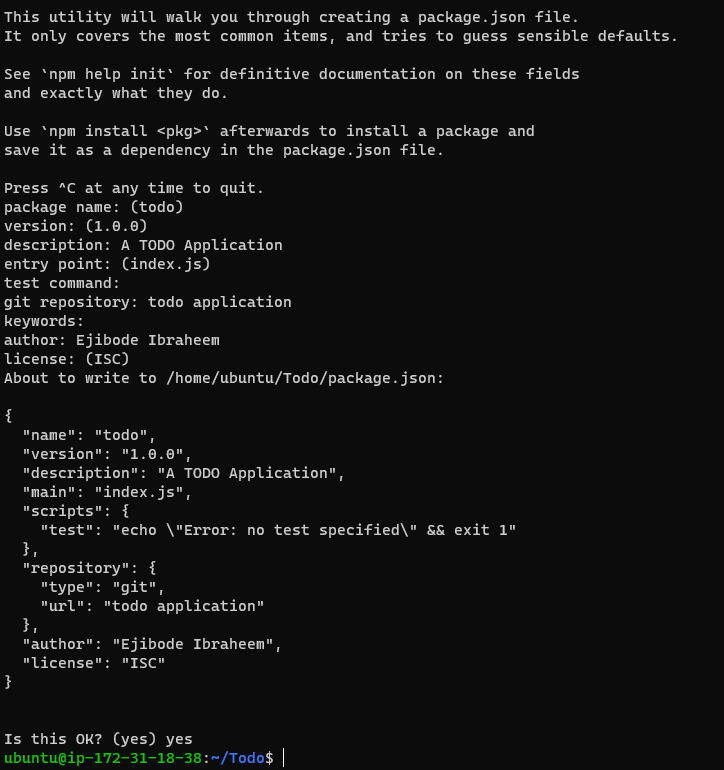
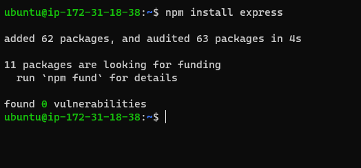
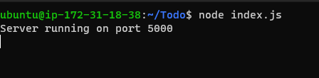
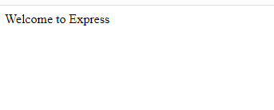
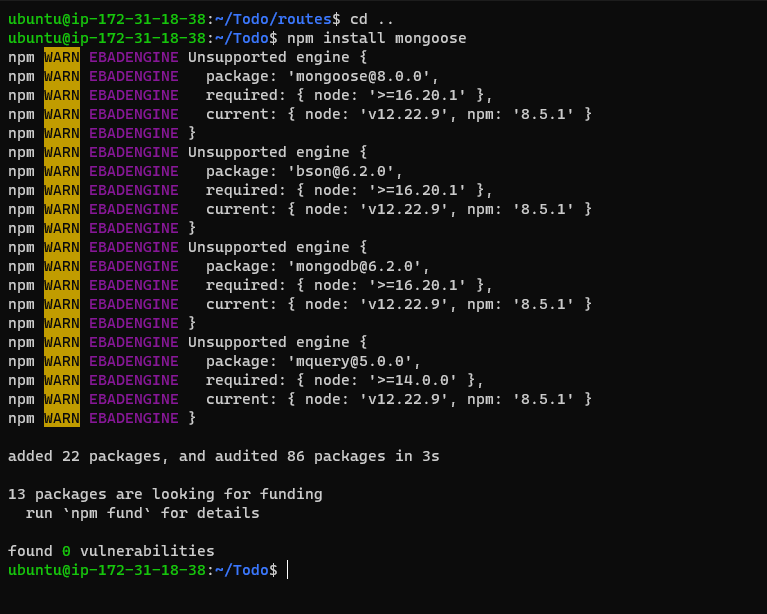
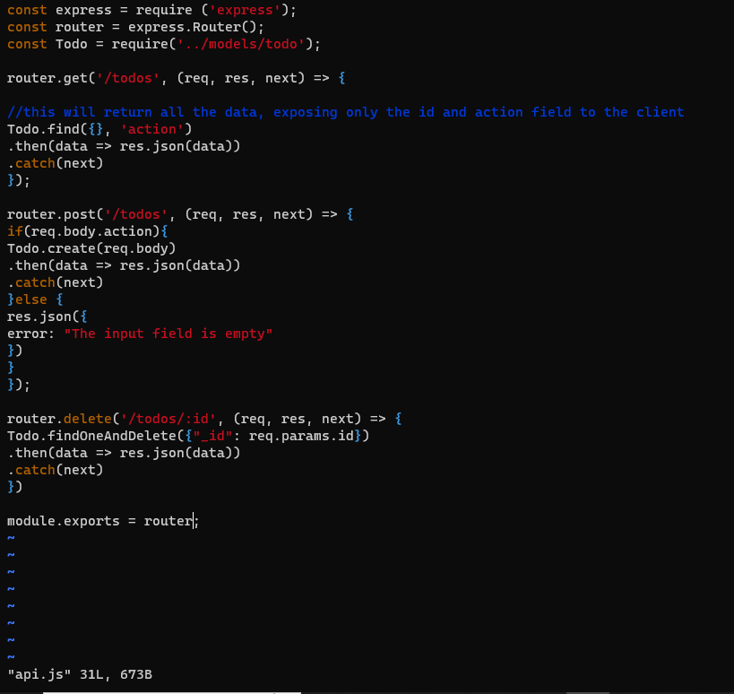

# My task is to implement a web solution based on MERN stack in AWS cloud

## MERN web stack consists of the following components

- MongoDB: A document-based, No-SQL database used to store application data in a form of documents.
- ExpressJS: A server side Web Application framework for Node.js.

- ReactJS: A frontend framework developed by Facebook. It is based on JavaScript, used to build User Interface (UI) components.

- Node.js: A JavaScript runtime environment. It is used to run JavaScript on a machine rather than in a browser.

# STEP 1 - BACKEND CONFIGURATION

- Update ubuntu by runnig:

`sudo apt update`

- I upgraded ubuntu by running this command:

`sudo apt upgrade`

- This command upgrades to the latest version and discard the old version while update command update and still keep the old version

- I Installed Node.js with the command below

`sudo apt-get install -y nodejs`

-Note: The command above installs both nodejs and npm. NPM is a package manager for Node like apt for Ubuntu, it is used to install Node modules & packages and to manage dependency conflicts.

- I verified node is installed by running the command below

`node -v`

- I verified npm is installed by running this command

`npm -v`

- I created a new directory for my To-Do project:

`mkdir Todo`

- I changed my current directory to the newly created directory:

`cd Todo`

- Next, I used the command npm init to initialise my project, so that a new file named package.json will be created. This file will normally contain information about my application and the dependencies that it needs to run. Follow the prompts after running the command. I pressed Enter several times to accept default values, then accept to write out the package.json file by typing yes.

`npm init`

# STEP 2 - INSTALLATION OF EXPRESSJS

- Express is a framework for Node.js, therefore a lot of things developers would have programmed is already taken care of out of the box. Therefore it simplifies development, and abstracts a lot of low level details. For example, Express helps to define routes of  application based on HTTP methods and URLs.

- I installed express using npm:

`npm install express`

- Since index.js is my entry point,  a file index.js with the command below was created:

`touch index.js`

- dotenv module was installed using this command

`npm install dotenv`

- The index.js file was opened with the command below

`vim index.js`

- And rhe below lines of codes was pasted in the vi editor

- I opened the server to ensure it works by opening terminal in the same directory as the index.js file and typed:

`node index.js`

- I opened this port(5000) in EC2 Security Groups. 
- I Opened up my browser and tried to access my server’s Public IP or Public DNS name followed by port 5000:

- Routes
- There are three actions that the To-Do application needs to be able to do:

1. Create a new task
2. Display list of all tasks
3. Delete a completed task

- Each task will be associated with some particular endpoint and will use different standard HTTP request methods: POST, GET, DELETE.

- For each task, we need to create routes that will define various endpoints that the To-do app will depend on. So let us create a folder routes

`mkdir routes`

- Change directory to routes folder.

`cd routes`

- Now, I created a file api.js with the command below

`touch api.js`

- I opened the file with vi editor

 `vim api.js`

 - I copied the below code in the file

 `const express = require ('express');
const router = express.Router();

router.get('/todos', (req, res, next) => {

});

router.post('/todos', (req, res, next) => {

});

router.delete('/todos/:id', (req, res, next) => {

})

module.exports = router;`

# Creating models

- A model is at the heart of JavaScript based applications, and it is what makes it interactive.

- I  also used models to define the database schema . This is important so that we will be able to define the fields stored in each Mongodb document.

- To create a Schema and a model, install mongoose which is a Node.js package that makes working with mongodb easier.

-  I Changed directory back Todo folder with cd .. and install Mongoose

`npm install mongoose`

- I created a new folder models :

`mkdir models && cd models && touch todo.js`

- I opened the todo.js file and pasted the following command:

`const mongoose = require('mongoose');
const Schema = mongoose.Schema;

//create schema for todo
const TodoSchema = new Schema({
action: {
type: String,
required: [true, 'The todo text field is required']
}
})

//create model for todo
const Todo = mongoose.model('todo', TodoSchema);

module.exports = Todo;`

- Now we need to update our routes from the file api.js in ‘routes’ directory to make use of the new model.

- In Routes directory, open api.js with vim api.js, delete the code inside with :%d command and paste there code below into it then save and exit

`const express = require ('express');
const router = express.Router();
const Todo = require('../models/todo');

router.get('/todos', (req, res, next) => {

//this will return all the data, exposing only the id and action field to the client
Todo.find({}, 'action')
.then(data => res.json(data))
.catch(next)
});

router.post('/todos', (req, res, next) => {
if(req.body.action){
Todo.create(req.body)
.then(data => res.json(data))
.catch(next)
}else {
res.json({
error: "The input field is empty"
})
}
});

router.delete('/todos/:id', (req, res, next) => {
Todo.findOneAndDelete({"_id": req.params.id})
.then(data => res.json(data))
.catch(next)
})

module.exports = router;`

# STEP 4 - MONGODB DATABASE
