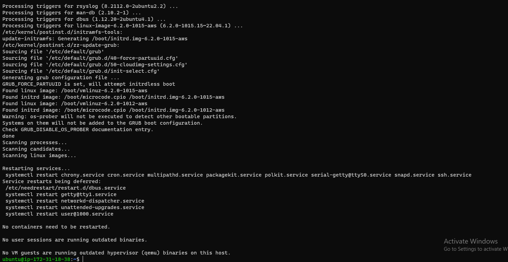

# My task is to implement a web solution based on MERN stack in AWS cloud

## MERN web stack consists of the following components

- MongoDB: A document-based, No-SQL database used to store application data in a form of documents.
- ExpressJS: A server side Web Application framework for Node.js.

- ReactJS: A frontend framework developed by Facebook. It is based on JavaScript, used to build User Interface (UI) components.

- Node.js: A JavaScript runtime environment. It is used to run JavaScript on a machine rather than in a browser.

# STEP 1 - BACKEND CONFIGURATION

- Update ubuntu by runnig:

`sudo apt update`

- I upgraded ubuntu by running this command:

`sudo apt upgrade`

- This command upgrades to the latest version and discard the old version while update command update and still keep the old version

- I Installed Node.js with the command below

`sudo apt-get install -y nodejs`

-Note: The command above installs both nodejs and npm. NPM is a package manager for Node like apt for Ubuntu, it is used to install Node modules & packages and to manage dependency conflicts.

- I verified node is installed by running the command below

`node -v`

- I verified npm is installed by running this command

`npm -v`

- I created a new directory for my To-Do project:

`mkdir Todo`

- I changed my current directory to the newly created directory:

`cd Todo`

- Next, I used the command npm init to initialise my project, so that a new file named package.json will be created. This file will normally contain information about my application and the dependencies that it needs to run. Follow the prompts after running the command. I pressed Enter several times to accept default values, then accept to write out the package.json file by typing yes.

`npm init`

# STEP 2 - INSTALLATION OF EXPRESSJS

- Express is a framework for Node.js, therefore a lot of things developers would have programmed is already taken care of out of the box. Therefore it simplifies development, and abstracts a lot of low level details. For example, Express helps to define routes of  application based on HTTP methods and URLs.

- I installed express using npm:

`npm install express`

- Since index.js is my entry point,  a file index.js with the command below was created:

`touch index.js`

- dotenv module was installed using this command

`npm install dotenv`

- The index.js file was opened with the command below

`vim index.js`

- And rhe below lines of codes was pasted in the vi editor

- I opened the server to ensure it works by opening terminal in the same directory as the index.js file and typed:

`node index.js`

- I opened this port(5000) in EC2 Security Groups. 
- I Opened up my browser and tried to access my server’s Public IP or Public DNS name followed by port 5000:

- Routes
- There are three actions that the To-Do application needs to be able to do:

1. Create a new task
2. Display list of all tasks
3. Delete a completed task

- Each task will be associated with some particular endpoint and will use different standard HTTP request methods: POST, GET, DELETE.

- For each task, we need to create routes that will define various endpoints that the To-do app will depend on. So let us create a folder routes

`mkdir routes`

- Change directory to routes folder.

`cd routes`

- Now, I created a file api.js with the command below

`touch api.js`

- I opened the file with vi editor

 `vim api.js`

 - I copied the below code in the file

 `const express = require ('express');
const router = express.Router();

router.get('/todos', (req, res, next) => {

});

router.post('/todos', (req, res, next) => {

});

router.delete('/todos/:id', (req, res, next) => {

})

module.exports = router;`

# Creating models

- A model is at the heart of JavaScript based applications, and it is what makes it interactive.

- I  also used models to define the database schema . This is important so that we will be able to define the fields stored in each Mongodb document.

- To create a Schema and a model, install mongoose which is a Node.js package that makes working with mongodb easier.

-  I Changed directory back Todo folder with cd .. and install Mongoose

`npm install mongoose`

- I created a new folder models :

`mkdir models && cd models && touch todo.js`

- I opened the todo.js file and pasted the following command:

`const mongoose = require('mongoose');
const Schema = mongoose.Schema;

//create schema for todo
const TodoSchema = new Schema({
action: {
type: String,
required: [true, 'The todo text field is required']
}
})

//create model for todo
const Todo = mongoose.model('todo', TodoSchema);

module.exports = Todo;`

- Now we need to update our routes from the file api.js in ‘routes’ directory to make use of the new model.

- In Routes directory, open api.js with vim api.js, delete the code inside with :%d command and paste there code below into it then save and exit

`const express = require ('express');
const router = express.Router();
const Todo = require('../models/todo');

router.get('/todos', (req, res, next) => {

//this will return all the data, exposing only the id and action field to the client
Todo.find({}, 'action')
.then(data => res.json(data))
.catch(next)
});

router.post('/todos', (req, res, next) => {
if(req.body.action){
Todo.create(req.body)
.then(data => res.json(data))
.catch(next)
}else {
res.json({
error: "The input field is empty"
})
}
});

router.delete('/todos/:id', (req, res, next) => {
Todo.findOneAndDelete({"_id": req.params.id})
.then(data => res.json(data))
.catch(next)
})

module.exports = router;`

# STEP 4 - Testing Backend Code Without using Frontend using RESTful API

- So far we have written our TODO application, and configured backend database, but we do not have a frontend UI yet. We need ReactJS code to achieve that. But during development, we will need a way to test our code using RESTFUL API. Therefore, we will need to make use of some api development clients to test our code.

- In this project, we will use Postman to test for our API.

- Install Postman in Ubuntu

`sudo snap install postman`

- Now we open our Postman, We will create a ‘POST’ and ‘GET’ request in postman to the API http://localhost:5000/api/todos

- POST Request

- GET REQUEST

# STEP 5 -  CREATING THE FRONTEND
- we are done with the functionality we want from our api, it is time to create an interface for the client to interact with the api. To start out with the frontend of the todo app, we will use the create-react-app command to scaffold our app.

- In our Todo directory, We will run:

`$ npx create-react-app client`

- This will create a new folder in our Todo directory called client, where we will add all the react code.

### step 6- Running the React App

- Before testing the react app, there are a number of dependencies that need to be installed.

- We need to Install concurrently: It is used to run more than one command simultaneously from the same terminal window.

` npm install concurrently --save-dev`

- We need to Install nodemon: It is used to run and monitor the server. If there is any change in the server code, nodemon will restart it automatically and load the new changes.

`npm install nodemon --save-dev`

- In the Todo folder, open the package.json file. Change the highlighted part of the below screenshot and replace with the code below.

`"scripts": {
"start": "node index.js",
"start-watch": "nodemon index.js",
"dev": "concurrently \"npm run start-watch\" \"cd client && npm start\""
},`

### Step 7 -Configure proxy in package.json

- Enter into the client folder from Todo directory

` cd client`

- Open the package.json file

` vi package.json`
- Add the key value pair in the package.json file "proxy": "http://localhost:5000".

- The whole purpose of adding the proxy configuration  above is to make it possible to access the application directly from the browser by simply calling the server url like http://localhost:5000 rather than always including the entire path like http://localhost:5000/api/todos

## Now we will ensure that we are inside Todo directory and run
`npm run dev`

- 

- Your app should open and start running on localhost:3000

- Important note: In order to be able to access the application from the Internet you have to open TCP port 3000 on EC2 by adding a new Security Group rule. You already know how to do it.

## STEP 8 - Creating Our React Components

- Creating your React Components One of the advantages of react is that it makes use of components, which are reusable and also makes code modular. For our Todo app, there will be two stateful components and one stateless component. From your Todo directory run

`cd client`

- Move to the src directory

 `cd src`

 - Inside your src folder create another folder called components and move into it

 `mkdir components && cd components`

 - Inside ‘components’ directory create three files Input.js, ListTodo.js and Todo.js.
 
 `touch Input.js && ListTodo.js && Todo.js`

 - Open Input.js file

 `vi Input.js`

 - Copy and paste the following

 `import React, { Component } from 'react';
import axios from 'axios';

class Input extends Component {

state = {
action: ""
}

addTodo = () => {
const task = {action: this.state.action}

    if(task.action && task.action.length > 0){
      axios.post('/api/todos', task)
        .then(res => {
          if(res.data){
            this.props.getTodos();
            this.setState({action: ""})
          }
        })
        .catch(err => console.log(err))
    }else {
      console.log('input field required')
    }

}

handleChange = (e) => {
this.setState({
action: e.target.value
})
}

render() {
let { action } = this.state;
return (

<input type="text" onChange={this.handleChange} value={action} />
<button onClick={this.addTodo}>add todo</button>

)
}
}

export default Input`

- Axios is a promise based HTTP client for the browser and node.js, you need to cd into your client from your terminal and run

 `yarn add axios or npm install axios.`

 - Move to the clients folder

 `cd../..`

- Install Axios in the clients folder

`npm install axios`

- Go to components directory

` cd src/components`

- After that open your ListTodo.js

`$ vi ListTodo.js`

- In the ListTodo.js copy and paste the following code

`import React from 'react';

const ListTodo = ({ todos, deleteTodo }) => {

return (
<ul>
{
todos &&
todos.length > 0 ?
(
todos.map(todo => {
return (
<li key={todo._id} onClick={() => deleteTodo(todo._id)}>{todo.action}</li>
)
})
)
:
(
<li>No todo(s) left</li>
)
}
</ul>
)
}

export default ListTodo`

- Then in your Todo.js file you write the following code

`import React, {Component} from 'react';
import axios from 'axios';

import Input from './Input';
import ListTodo from './ListTodo';

class Todo extends Component {

state = {
todos: []
}

componentDidMount(){
this.getTodos();
}

getTodos = () => {
axios.get('/api/todos')
.then(res => {
if(res.data){
this.setState({
todos: res.data
})
}
})
.catch(err => console.log(err))
}

deleteTodo = (id) => {

    axios.delete(`/api/todos/${id}`)
      .then(res => {
        if(res.data){
          this.getTodos()
        }
      })
      .catch(err => console.log(err))

}

render() {
let { todos } = this.state;

    return(
      

        <h1>My Todo(s)</h1>
        <Input getTodos={this.getTodos}/>
        <ListTodo todos={todos} deleteTodo={this.deleteTodo}/>
      

    )

}
}

export default Todo;`

- We need to make little adjustment to our react code. Delete the logo and adjust our App.js to look like this.

- Move to the src folder

`cd ..`

- Make sure that you are in the src folder and run

`vi App.js`

- Copy and paste the code below into it

`import React from 'react';

import Todo from './components/Todo';
import './App.css';

const App = () => {
return (

<Todo />

);
}

export default App;`

- After pasting, exit the editor.

- In the src directory open the App.css

`vi App.css`

- Then paste the following code into App.css:

`.App {
text-align: center;
font-size: calc(10px + 2vmin);
width: 60%;
margin-left: auto;
margin-right: auto;
}

input {
height: 40px;
width: 50%;
border: none;
border-bottom: 2px #101113 solid;
background: none;
font-size: 1.5rem;
color: #787a80;
}

input:focus {
outline: none;
}

button {
width: 25%;
height: 45px;
border: none;
margin-left: 10px;
font-size: 25px;
background: #101113;
border-radius: 5px;
color: #787a80;
cursor: pointer;
}

button:focus {
outline: none;
}

ul {
list-style: none;
text-align: left;
padding: 15px;
background: #171a1f;
border-radius: 5px;
}

li {
padding: 15px;
font-size: 1.5rem;
margin-bottom: 15px;
background: #282c34;
border-radius: 5px;
overflow-wrap: break-word;
cursor: pointer;
}

@media only screen and (min-width: 300px) {
.App {
width: 80%;
}

input {
width: 100%
}

button {
width: 100%;
margin-top: 15px;
margin-left: 0;
}
}

@media only screen and (min-width: 640px) {
.App {
width: 60%;
}

input {
width: 50%;
}

button {
width: 30%;
margin-left: 10px;
margin-top: 0;
}
}`

## EXIT
- In the src directory open the index.css

`vim index.css`

`body {
margin: 0;
padding: 0;
font-family: -apple-system, BlinkMacSystemFont, "Segoe UI", "Roboto", "Oxygen",
"Ubuntu", "Cantarell", "Fira Sans", "Droid Sans", "Helvetica Neue",
sans-serif;
-webkit-font-smoothing: antialiased;
-moz-osx-font-smoothing: grayscale;
box-sizing: border-box;
background-color: #282c34;
color: #787a80;
}

code {
font-family: source-code-pro, Menlo, Monaco, Consolas, "Courier New",
monospace;
}`

- Go to the Todo directory

`cd../..`

- When you are in the Todo directory run:

`npm run dev`

- Assuming no errors when saving all these files, our To-Do app should be ready and fully functional with the functionality discussed earlier: creating a task, deleting a task and viewing all your tasks.

