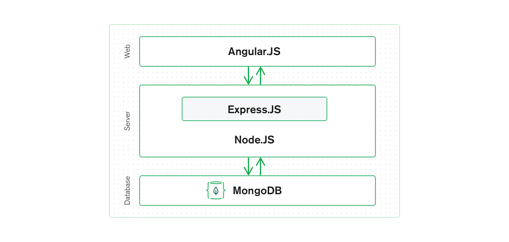

# MEAN -STACK

## What is MEAN-STACK
-MEAN stands for:

- MongoDB
- Express.js
- AngularJS
- Node.js.

- MEAN is an end-to-end JavaScript stack largely used for cloud-ready applications. MEAN is a full-stack development toolkit which is also refer to as a collection of JavaScript technologies used to develop web applications from the client to the server and from server to database, everything is based on JavaScript. It is also free and open-source stack which offers a quick and organized method for creating rapid prototypes for web-based applications.

### MEAN-STACK is composed of four different technologies

- MongoDB (Document database): Stores and retrieve data.
- Express JS (Back-end application framework): Makes requests to Database and return a response
- AngularJS (Front-end application framework): Handles Client and Server Requests
- Node.js (JavaScript runtime environment): Accept requests and display results to end user

- There are variations to the MEAN stack such as MERN (replacing Angular.js with React.js) and MEVN (using Vue.js). The MEAN stack is one of the most popular technology concepts for building web applications.

## How Does The MEAN-STACK work?

### MEAN-STACK ARCHITECTURE

- The MEAN architecture is designed to make building web applications in JavaScript and handling JSON incredibly easy.

##