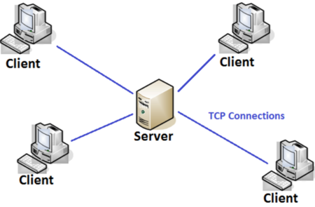
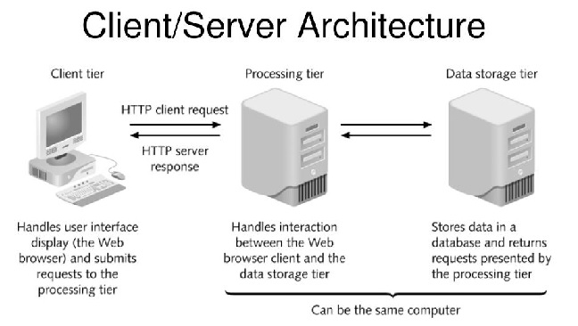

# CLIENT-SERVER-ARCHITECTURE-USING-A-MYSQL-RELATIONAL-DATABASE-MANAGEMENT-SYSTEM

### Client-Server Architecture

- Client-server architecture is an architecture of a computer network in which many clients (remote processors) request and receive service from a centralized server (host computer). Client computers provide an interface to allow a computer user to request services of the server and to display the results the server returns. Servers wait for requests to arrive from clients and then respond to them. Ideally, a server provides a standardized transparent interface to clients so that clients need not be aware of the specifics of the system (i.e., the hardware and software) that is providing the service. Clients are often situated at workstations or on personal computers, while servers are located elsewhere on the network, usually on more powerful machines. This computing model is especially effective when clients and the server each have distinct tasks that they routinely perform. In hospital data processing, for example, a client computer can be running an application program for entering patient information while the server computer is running another program that manages the database in which the information is permanently stored.

- Client Server Architecture

- At its simplest, the client/server architecture is about dividing up application processing into two or more logically distinct pieces. The database makes up half of the client/server architecture. The database is the “server”; any application that uses that data is a “client.” In many cases, the client and server reside on separate machines; in most cases, the client application is some sort of user-friendly interface to the database.

-

##### A graphical representation of a simple client/server system.

### Lets take a very quick example and see Client-Server communicatation in action.

- We open up out terminal and install curl if it doesnt exist.

`$ sudo apt -y install curl`

### In this example, the linux terminal will be the client, while www.propitixhomes.com will be the server

- Send a request from client (Linux Terminal) with the curl command below

`$ curl -Iv www.propitixhomes.com`

##### We should see the response from the remote server in below output.

## In this project we will be Implementing a Client Server Architecture using a Database Management System (MySQL).

- The instructions below will be followed to complete the project.
`Server A - mysql server
Server B - mysql client`

- On mysql server Linux Server, we will install the MySQL software.

`$ sudo apt install mysql-server -y`
- We need to configure our mysql server installation using this command

`$ sudo mysql_secure_installation`

