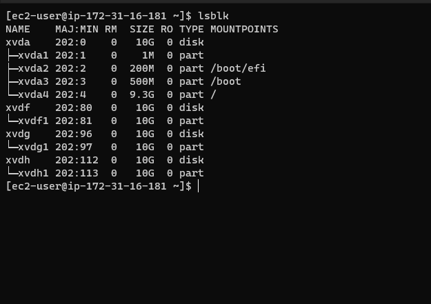

# Web-Solution-With-Wordpress

- WordPress (WP, WordPress.org) is a free and open-source content management system (CMS) written in PHP[4] and paired with a MySQL or MariaDB database. Features include a plugin architecture and a template system, referred to within WordPress as Themes. WordPress was originally created as a blog-publishing system but has evolved to support other web content types including more traditional mailing lists and forums, media galleries, membership sites, learning management systems (LMS) and online stores.

- To function, WordPress has to be installed on a web server, either part of an Internet hosting service like WordPress.com or a computer running the software package WordPress.org in order to serve as a network host in its own right.

## Three-tier Architecture

#### Generally, web, or mobile solutions are implemented based on what is called the Three-tier Architecture.

#### 3-Tier Setup

- A Laptop or PC to serve as a client
- An EC2 Linux Server as a web server (This is where you will install WordPress)
- An EC2 Linux server as a database (DB) server

- Three-tier Architecture allows any one of the three tiers to be upgraded or replaced independently.
- The user interface is implemented on any platform such as a desktop PC, smartphone or tablet as a native application, web app, mobile app, voice interface, etc. It uses a standard graphical user interface with different modules running on the application server.
- The relational database management system on the database server contains the computer data storage logic.
- The middle tiers are usually multitiered.
- Since the three are not physical but logical in nature, they may run in different servers both in on-premises based solutions, as well as in software-as-a-service (SaaS).

#### Benefit of a Three-Tier Architecture

- it provides great freedom to development teams who can independently update or replace only specific parts of the application without affecting the product as a whole.

- The application can be scaled up and out rather easily by detaching the front-end application from the databases that are selected according to the individual needs of the customer.

- New hardware, such as new servers, can also be added at a later time to deal with massive amounts of data or particularly demanding services
- A three-tier-architecture also provides a higher degree of flexibility to enterprises who may want to adopt a new technology as soon as it becomes available.

- Critical components of the application can be encapsulated and retained while the whole system keeps evolving organically.

- Development cycle or upgrade times are significantly improved ensuring minimal disruption in customer’s experience.

- Different teams can work on different sections of the application rather than on the full stack according to their areas of expertise, improving their efficiency and speed.

### The Three Tiers in a Three-Tier Architecture

### Presentation Tier

- Occupies the top level and displays information related to services commonly available on a web browser or web-based application in the form of a graphical user interface (GUI).
- It constitutes the front-end layer of the application and the interface with which end-users will interact directly.

- This tier is usually built on web development frameworks, such as CSS or JavaScript, and communicates with other tiers by sending results to the browser and other tiers in the network through API calls.

### Application Tier

- This tier — also called the middle tier, logic tier, business logic or logic tier — is pulled from the presentation tier.

- It controls the application’s core functionality by performing detailed processing and is usually coded in programming languages, such as Python, Java, C++, .NET, etc.

### Data Tier

- Houses database servers where information is stored and retrieved.
- Data in this tier is kept independent of application servers or business logic, and is managed and accessed with programs, such as MongoDB, Oracle, MySQL, and Microsoft SQL Server.

## In this project, We will have the hands-on experience that showcases Three-tier Architecture while also ensuring that the disks used to store files on the Linux servers are adequately partitioned and managed through programs such as gdisk and LVM respectively. The following steps will be followed to achieve our aim and objectives of this project.

## LAUNCH AN EC2 INSTANCE THAT WILL SERVE AS “WEB SERVER”.

## Step 1 — Prepare the Web Server

1. Launch an EC2 instance that will serve as "Web Server". Create 3 volumes in the same AZ as your Web Server EC2, each of 10 GiB.
2. Create and Attach all three volumes one by one to your Web Server EC2 instance

3. Open MobaXterm and connect Ec2 instances using public IP Address and begin configuration

`lsblk`

`df -h`

`sudo gdisk /dev/xvdf`

`sudo gdisk /dev/xvdg`

`sudo gdisk /dev/xvdh`

- We will use the command below to view the newly configured partition on each of the 3 disks
  `lsblk`

- install lvm using this command

`sudo yum install lvm2 -y`

- To confirm if lvm is successfully installed, we run this command

`which lvm`

- Use pvcreate utility to mark each of 3 disks as physical volumes (PVs) to be used by LVM
  

- To confirm if you have physical volumes created, run this command

`sudo pvs`

- Use vgcreate utility to add all 3 PVs to a volume group (VG). Name the VG webdata-vg

`sudo vgcreate webdata-vg /dev/xvdh1 /dev/xvdg1 /dev/xvdf1`

- Verify that your VG has been created successfully by running

`sudo vgs`

- Use lvcreate utility to create 2 logical volumes. apps-lv (Use half of the PV size), and
- logs-lv Use the remaining space of the PV size. NOTE: apps-lv will be used to store data for the Website while, logs-lv will be used to store data for logs.

- Verify that your VG has been created successfully by running

`sudo lvs`

- Use mkfs.ext4 to format the logical volumes with ext4 filesystem
`sudo mkfs -t ext4 /dev/webdata-vg/apps-lv
sudo mkfs -t ext4 /dev/webdata-vg/logs-lv`

- Create /var/www/html directory to store website files

`sudo mkdir -p /home/recovery/logs`

- Create /home/recovery/logs to store backup of log data

`sudo mkdir -p /home/recovery/logs

- Mount /var/www/html on apps-lv logical volume

`sudo mount /dev/webdata-vg/apps-lv /var/www/html/`

- Use rsync utility to backup all the files in the log directory /var/log into /home/recovery/logs (This is required before mounting the file system)

`sudo rsync -av /var/log/. /home/recovery/logs/`

### Mount /var/log on logs-lv logical volume. (Note that all the existing data on /var/log will be deleted. That is why step 15 above is very important)

`sudo mount /dev/webdata-vg/logs-lv /var/log`

#### Restore log files back into /var/log directory

`sudo rsync -av /home/recovery/logs/. /var/log`

#### Update /etc/fstab file so that the mount configuration will persist after restart of the server.

- The UUID of the device will be used to update the /etc/fstab file;

`sudo blkid`

`sudo vi /etc/fstab`

##### Test the configuration and reload the daemon
`sudo mount -a
sudo systemctl daemon-reload`

#### Verify your setup by running df -h, output must look like this:
`df -h `

### Step 2 — Prepare the Database Server
1.  Launch a second RedHat EC2 instance that will have a role – ‘DB Server’
2. Create and Attach all three volumes one by one to your DB Server EC2 instance
3. Open MobaXterm and connect Ec2 instances using public IP Address and begin configuration

`df -h`

- We need to create a single partition on each of the 3 disks we added

- We will use the command below to view the newly configured partition on each of the 3 disks

`$ sudo lsblk`

- Use pvcreate utility to mark each of 3 disks as physical volumes (PVs) to be used by LVM

`sudo pvcreate /dev/xvdf1`

- Verify that your Physical volume has been created successfully by running
`sudo pvs`

- Use vgcreate utility to add all 3 PVs to a volume group (VG). Name the VG database-vg

`sudo vgcreate vg-database /dev/xvdh1 /dev/xvdg1 /dev/xvdf1`

- Verify that your VG has been created successfully by running

`sudo vgs`

- Use lvcreate utility to create 2 logical volumes. apps-lv (Use half of the PV size), and logs-lv Use the remaining space of the PV size. NOTE: apps-lv will be used to store data for the Website while, logs-lv will be used to store data for logs.

- Use lvcreate utility to create 2 logical volumes. apps-lv (Use half of the PV size), and logs-lv Use the remaining space of the PV size. NOTE: apps-lv will be used to store data for the Website while, logs-lv will be used to store data for logs.

`sudo lvcreate -n db-lv -L 20G database-vg`

- Verify that your Logical Volume has been created successfully by running

`sudo lvs`

- Verify the entire setup

`sudo vgdisplay -v #view complete setup - VG, PV, and LV
sudo lsblk `

- Use mkfs.ext4 to format the logical volumes with ext4 filesystem

`sudo mkfs -t ext4 /dev/vg-database/db-lv`

- We need to create /db directory to store our database files

`$ sudo mkdir /db`

- We need to create /home/recovery/logs to store backup of log data

`$ sudo mkdir -p /home/recovery/logs`

- We need to Mount /db on db-lv logical volume

`sudo mount /dev/vg-database/db-lv /db`

`df -h`

- We need to backup all the files in the log directory /var/log into /home/recovery/logs (This is required before mounting the file system)

## Step 3 — Install WordPress on your Web Server EC2

1. Update the repository

`sudo yum -y update`

2. Install wget, Apache and it’s dependencies

`sudo yum -y install wget httpd php php-mysqlnd php-fpm php-json`

3. Start Apache

`sudo systemctl enable httpd
sudo systemctl start httpd
sudo systemctl status httpd`

4. To install PHP and it’s dependencies

`sudo yum install https://dl.fedoraproject.org/pub/epel/epel-release-latest-8.noarch.rpm
sudo yum install yum-utils http://rpms.remirepo.net/enterprise/remi-release-8.rpm
sudo yum module list php
sudo yum module reset php
sudo yum module enable php:remi-7.4
sudo yum install php php-opcache php-gd php-curl php-mysqlnd
sudo systemctl start php-fpm
sudo systemctl enable php-fpm
sudo setsebool -P httpd_execmem 1`

`sudo systemctl status`

5. Restart Apache

`sudo systemctl restart httpd`

6. Download wordpress and copy wordpress to var/www/html

`  mkdir wordpress
  cd   wordpress
  sudo wget http://wordpress.org/latest.tar.gz
  sudo tar xzvf latest.tar.gz
  sudo rm -rf latest.tar.gz
  cp wordpress/wp-config-sample.php wordpress/wp-config.php
  cp -R wordpress /var/www/html/`

  7. Configure SELinux Policies

  `sudo chown -R apache:apache /var/www/html/wordpress
sudo chcon -t httpd_sys_rw_content_t /var/www/html/wordpress -R
sudo setsebool -P httpd_can_network_connect=1`

- 

``
## Step 5 — Configure DB to work with WordPress

`sudo mysql
CREATE DATABASE wordpress;
CREATE USER `myuser`@`<Web-Server-Private-IP-Address>` IDENTIFIED BY 'wordpres';
GRANT ALL ON wordpres.* TO 'myuser'@'<Web-Server-Private-IP-Address>';
FLUSH PRIVILEGES;
SHOW DATABASES;
exit`

## Step 6 — Configure WordPress to connect to remote database.

1. Install MySQL client and test that you can connect from your Web Server to your DB server by using mysql-client

`sudo yum install mysql
sudo mysql -h <DB-Server-Private-IP-address> -u wordpres -p`

2. Verify if you can successfully execute SHOW DATABASES; command and see a list of existing databases.

3. Change permissions and configuration so Apache could use WordPress:

4. Enable TCP port 80 in Inbound Rules configuration for your Web Server EC2 (enable from everywhere 0.0.0.0/0 or from your workstation’s IP)

5. Try to access from your browser the link to your WordPress http:///wordpress/

