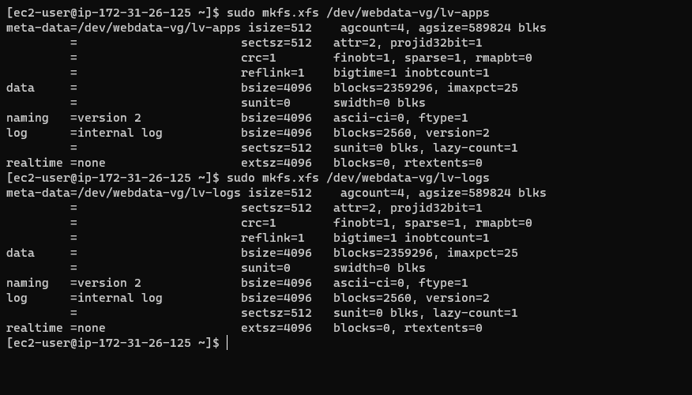
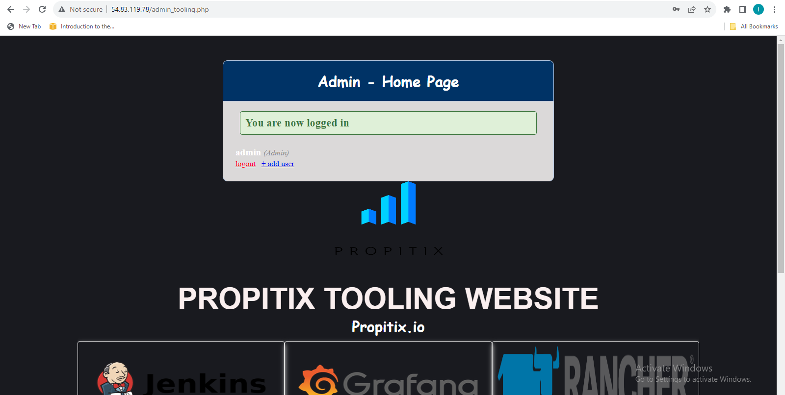

## DEVOPS-TOOLING-WEBSITE-SOLUTION

## NFS Server

- Network File System (NFS) is a distributed file system protocol originally developed by Sun Microsystems (Sun) in 1984, allowing a user on a client computer to access files over a computer network much like local storage is accessed. NFS, like many other protocols, builds on the Open Network Computing Remote Procedure Call (ONC RPC) system. NFS is an open standard defined in a Request for Comments (RFC), allowing anyone to implement the protocol.

- NFS is a very useful tool but, historically, it has suffered from many limitations, most of which have been addressed with version 4 of the protocol. The downside is that the latest version of NFS is harder to configure when you want to make use of basic security features such as authentication and encryption since it relies on Kerberos for those parts. And without those, the NFS protocol must be restricted to a trusted local network since data goes over the network unencrypted (a sniffer can intercept it) and access rights are granted based on the client's IP address (which can be spoofed).

- As a member of a DevOps team, We will implement a tooling website solution which makes access to DevOps tools within the corporate infrastructure easily accessible.

### Step 1 — Prepare the NFS Server

- We need to create a single partition on each of the 3 disks we added to our NFS Server using the command.

`sudo gdisk /dev/xvdf`

`sudo gdisk /dev/xvdg`

`sudo gdisk /dev/xvdh`

- We need to mark the disks as LVM physical volumes with the command

`sudo pvcreate /dev/xvdf1 /dev/xvdg1 /dev/xvdh1`

- We need to add the PVs to a volume group. We will Name the VG webdata-vg

`sudo vgcreate webdata-vg /dev/xvdf1 /dev/xvdg1 /dev/xvdh1`

- We need to create 3 logical volumes lv-opt , lv-apps and lv-logs for out mount.

`sudo lvcreate -L 9G -n lv-opt webdata-vg`

`sudo lvcreate -L 9G -n lv-apps webdata-vg`

`sudo lvcreate -L 9G -n lv-logs webdata-vg`

- We need to format the logical volume with XFS filesystem

`sudo mkfs.xfs /dev/webdata-vg/lv-opt`

`sudo mkfs.xfs /dev/webdata-vg/lv-apps`

`sudo mkfs.xfs /dev/webdata-vg/lv-logs`

- We need to create mount points on /mnt directory for the logical volumes: Mount lv-apps on /mnt/html To be used by webservers

`sudo mkdir  /mnt/apps`

`sudo mkdir  /mnt/logs`

`sudo mkdir  /mnt/opt`

- We need to Mount lv-apps on /mnt/apps logical volume

`sudo mount /dev/webdata-vg/lv-apps /mnt/apps/`

- We need to Mount lv-logs on /mnt/logs logical volume

`sudo mount /dev/webdata-vg/lv-logs /mnt/logs/`

- We need to Mount lv-opt on /mnt/opt logical volume

`sudo mount /dev/webdata-vg/lv-opt /mnt/opt/`

- We will Install and configure NFS server

`sudo yum -y update`

- We will Install and configure NFS server

`sudo yum -y update`

`sudo yum install nfs-utils -y`

`sudo systemctl start nfs-server.service`

`sudo systemctl enable nfs-server.service`

`sudo systemctl status nfs-server.service`

- As we want all clients to access the directory, we will remove restrictive permissions of the export folder through the following commands:

`sudo chown -R nobody: /mnt/opt`

`sudo chown -R nobody: /mnt/logs`

`sudo chown -R nobody: /mnt/apps`

- We need all users from all groups on the client system to be able to access our files.

`sudo chmod -R 777 /mnt/apps`

`sudo chmod -R 777 /mnt/logs`

`sudo chmod -R 777 /mnt/opt`

`sudo systemctl restart nfs-server.service`

- Configure access to NFS for clients within the same subnet (example of Subnet CIDR – 172.31.32.0/20 ):

`sudo vi /etc/exports

/mnt/apps <Subnet-CIDR>(rw,sync,no_all_squash,no_root_squash)
/mnt/logs <Subnet-CIDR>(rw,sync,no_all_squash,no_root_squash)
/mnt/opt <Subnet-CIDR>(rw,sync,no_all_squash,no_root_squash)

Esc + :wq!

sudo exportfs -arv`

- Check which port is used by NFS and open it using Security Groups (add new Inbound Rule)

`rpcinfo -p | grep nfs`

- mportant note: In order for NFS server to be accessible from your client, you must also open following ports: TCP 111, UDP 111, UDP 2049

## Step 2 — Configure the database server

- We are going to Install MySQL with the command

`sudo apt-get update`

`sudo apt -y install mysql-server`

- We need to create a database and name it tooling

`mysql> CREATE database tooling;`

- PHP applications because those commands uses caching_sha2_password for its password encryption. So we can only use the command below for the creation of the database user password.

- We need to create a database user and name it webaccess

` create user 'webaccess'@'172.31.16.0/20' IDENTIFIED WITH mysql_native_password by 'password';`

- We need to grant permission to webaccess user on tooling database to do anything only from the webservers

` GRANT ALL PRIVILEGES ON tooling.* TO 'webaccess'@'172.31.16.0/20';`

`FLUSH PRIVILEGES;`

## Prepare the Web Servers

- The webservers will use the NFS as its backend storage. Hence, it is important to configure the web servers as NFS client. We will follow the below steps to

- We need to update and Install NFS client

`sudo yum update -y`

`sudo yum install nfs-utils nfs4-acl-tools -y`

- Mount /var/www/ and target the NFS server’s export for apps

`sudo mkdir /var/www
sudo mount -t nfs -o rw,nosuid <NFS-Server-Private-IP-Address>:/mnt/apps /var/www`

- Verify that NFS was mounted successfully by running df -h. Make sure that the changes will persist on Web Server after reboot:

`sudo vi /etc/fstab`

- add following line

`<NFS-Server-Private-IP-Address>:/mnt/apps /var/www nfs defaults 0 0`

- Install Remi’s repository, Apache and PHP

`sudo yum install httpd -y

sudo dnf install https://dl.fedoraproject.org/pub/epel/epel-release-latest-8.noarch.rpm

sudo dnf install dnf-utils http://rpms.remirepo.net/enterprise/remi-release-8.rpm

sudo dnf module reset php

sudo dnf module enable php:remi-7.4

sudo dnf install php php-opcache php-gd php-curl php-mysqlnd

sudo systemctl start php-fpm

sudo systemctl enable php-fpm

setsebool -P httpd_execmem 1`

- We need to install git to clone our repository from out github account

`sudo yum install git`

- Ensure that the html folder from the repository is deployed to /var/www/html

`sudo cp -R  html/. /var/www/html `

