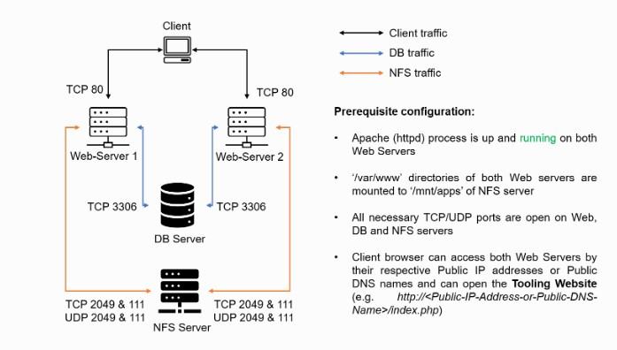

## Load-Balancer-Solution-With-Apache

### After completing Devops Tooling Website Solution we might wonder how a user will be accessing each of the webservers using 3 different IP addreses or 3 different DNS names. We might also wonder what is the point of having 3 different servers doing exactly the same thing.

### When we access a website in the Internet we use an URL and we do not really know how many servers are out there serving our requests, this complexity is hidden from a regular user, but in case of websites that are being visited by millions of users per day (like Google or facebook) it is impossible to serve all the users from a single Web Server (it is also applicable to databases, but for now we will not focus on distributed DBs).

### Each URL contains a domain name part, which is translated (resolved) to IP address of a target server that will serve requests when open a website in the Internet. Translation (resolution) of domain names is perormed by DNS servers.

### Load balancing

#### Refers to efficiently distributing incoming network traffic across a group of backend servers, also known as a server farm or server pool. Modern high‑traffic websites must serve hundreds of thousands, if not millions, of concurrent requests from users or clients and return the correct text, images, video, or application data, all in a fast and reliable manner. To cost‑effectively scale to meet these high volumes, modern computing best practice generally requires adding more servers.

###  A load balancer

### Acts as the “traffic cop” sitting in front of your servers and routing client requests across all servers capable of fulfilling those requests in a manner that maximizes speed and capacity utilization and ensures that no one server is overworked, which could degrade performance. If a single server goes down, the load balancer redirects traffic to the remaining online servers. When a new server is added to the server group, the load balancer automatically starts to send requests to it.

#### In this manner, a load balancer performs the following functions:

- Distributes client requests or network load efficiently across multiple servers
- Ensures high availability and reliability by sending requests only to servers that are online
- Provides the flexibility to add or subtract servers as demand dictates

#### Difference between L4 and L7 Load Balancing
#### L4 load balancing offers traffic management of transactions at the network protocol layer (TCP/UDP). L4 load balancing delivers traffic with limited network information with a load balancing algorithm (i.e. round-robin) and by calculating the best server based on fewest connections and fastest server response times.

#### L7 load balancing works at the highest level of the OSI model. L7 bases its routing decisions on various characteristics of the HTTP/HTTPS header, the content of the message, the URL type, and information in cookies.

#### In this project we will enhance our Tooling Website solution by adding a Load Balancer to disctribute traffic between Web Servers and allow users to access our website using a single URL.

### Task

### We will deploy and configure an Apache Load Balancer for Tooling Website solution on a separate Ubuntu EC2 instance. We will make sure that users can be served by Web servers through the Load Balancer. We can implement this solution with 2 Web Servers for simplicity, the approach will be the same for 3 and more Web Servers.

### Prerequisites

#### Make sure that we have the following servers installed and configured within Devops Tooling Website Solution:

- Two RHEL8 Web Servers
- One MySQL DB Server (based on Ubuntu 20.04)
- One RHEL8 NFS server

### STEP - 1

### Configure Apache As A Load Balancer

- Create an Ubuntu Server 20.04 EC2 instance and name it Project-8-apache-lb.

- Open TCP port 80 on Project-8-apache-lb by creating an Inbound Rule in Security Group.

- Install Apache Load Balancer on Project-8-apache-lb server and configure it to point traffic coming to LB to both Web Servers

### Install apache2

`$ sudo apt update
$ sudo apt install apache2 -y
$ sudo apt-get install libxml2-dev`

### Enable following modules:

`$ sudo a2enmod rewrite
$ sudo a2enmod proxy
$ sudo a2enmod proxy_balancer
$ sudo a2enmod proxy_http
$ sudo a2enmod headers
$ sudo a2enmod lbmethod_bytraffic`

### Restart apache2 service

` sudo systemctl restart apache2`

##

