# WEB-STACK IMPLEMENTATION USING LAMP

## STEP1- INSTALLATION OF APACHE AND FIREWALL UPDATE

- Installation of Apache using Ubuntu’s package manager ‘apt’

`sudo apt update`

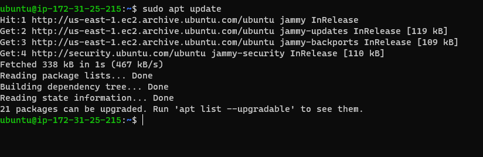

- run apache2 package installation

`sudo apt install apache2`

##### To be sure apache is running as a service in my OS, I ran the following command

`sudo systemctl status apache2`

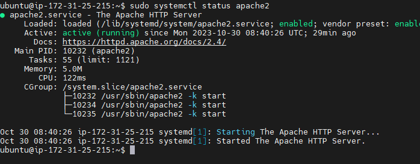

- My server is running and I can access it locally and from the Internet (Source 0.0.0.0/0 means ‘from any IP address’).
- To access it, run this command

`curl http://localhost:80`

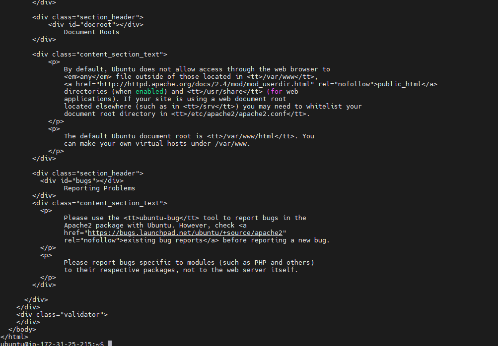

- To test how my Apache HTTP server can respond to requests from the Internet. I opened chrome and pasted this url

`http://107.23.157.242:80`

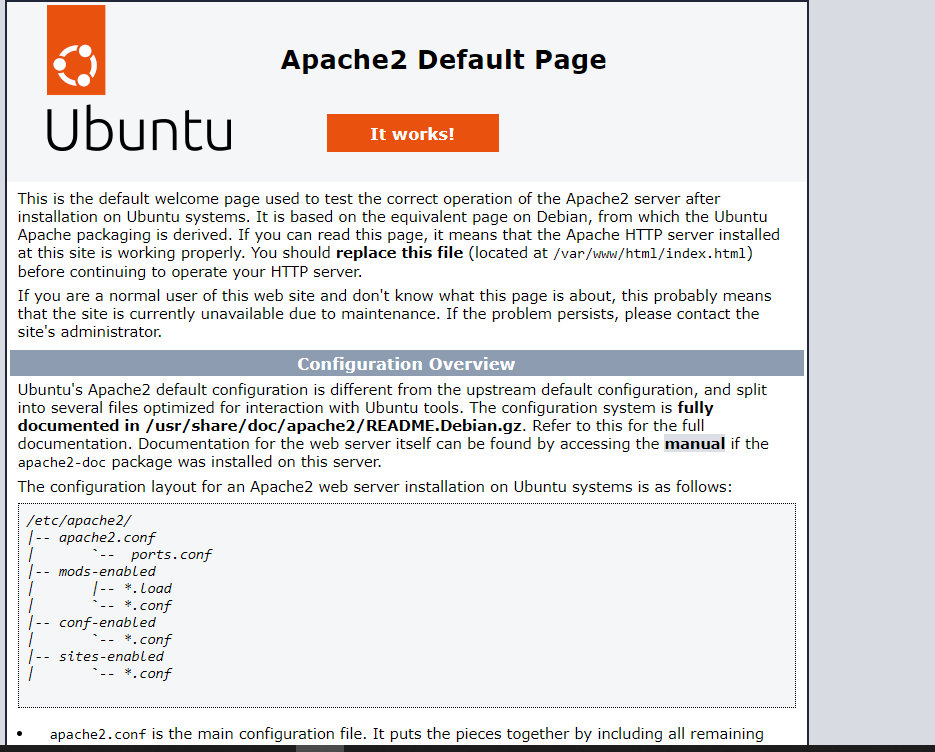

# STEP 2 - INSTALLATION OF MYSQL

- MYSQL is a Database Management System (DBMS) that stores and manages data for my site in a relational database. MySQL is a popular relational database management system used within PHP environments, so we will use it in our project.

`sudo apt install mysql-server`

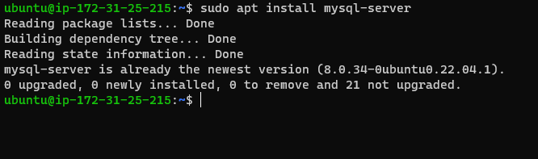

- I logged in into mysql by running the code below

`sudo mysql`

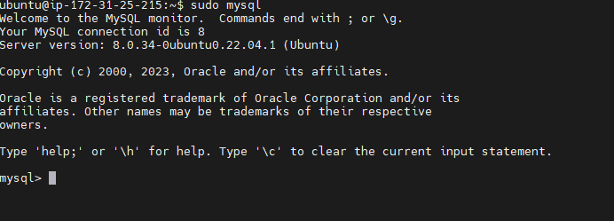

# STEP 3 - INSTALLATION OF PHP

- Installation of PHP was done using this code.

  `sudo apt install php libapache2-mod-php php-mysql`

- To confirm the version of PHP installed, I ran this command.

  `php -v`

  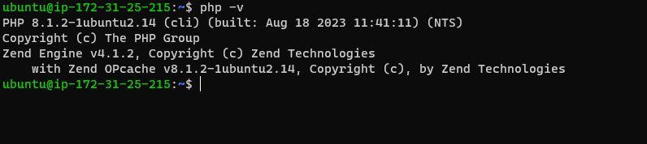

  # STEP4- CREATION OF VIRTUAL HOST FOR MY WEBSITE USING APACHE

- I set up a domain called projectlamp

- Apache on Ubuntu 20.04 has one server block enabled by default that is configured to serve documents from the /var/www/html directory.
- I created a directory for projectlamp using 'mkdir' command

`sudo mkdir /var/www/projectlamp`

-Next, I assigned ownership of the directory with my current system user(ubuntu):

`sudo chown -R $USER:$USER /var/www/projectlamp`

- Then, I created and opened a new configuration file in Apache’s sites-available directory using Vi:

  `sudo vi /etc/apache2/sites-available/projectlamp.conf`
  

- This created a new blank file. I Paste in the following bare-bones configuration by hitting on i on the keyboard to enter the insert mode, and pasted the text:

`<VirtualHost *:80>
    ServerName projectlamp
    ServerAlias www.projectlamp 
    ServerAdmin webmaster@localhost
    DocumentRoot /var/www/projectlamp
    ErrorLog ${APACHE_LOG_DIR}/error.log
    CustomLog ${APACHE_LOG_DIR}/access.log combined
</VirtualHost>`

- To save and close the file, I simply followed the steps below:

1. pressed the esc button on the keyboard

2. Typed :

3. Typed wq. w for write and q for quit

4. Pressed ENTER to save the file

- I used the ls command to show the new file in the sites-available directory

`sudo ls /etc/apache2/sites-available`

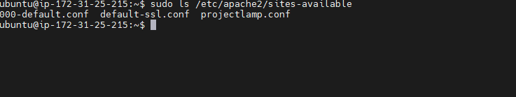

- I used a2ensite command to enable the new virtual host:

`sudo a2ensite projectlamp`

- I disabled Apache’s default website by using a2dissite command :

`sudo a2dissite 000-default`

- To make sure your configuration file doesn’t contain syntax errors, I ran:

`sudo apache2ctl configtest`

- Finally, I reloaded Apache so these changes take effect:

`sudo systemctl reload apache2`

- My new website is now active, but the web root /var/www/projectlamp is still empty. So.
  , I created an index.html file in that location so that I can test that the virtual host works as expected:

`sudo echo 'Hello LAMP from hostname' $(curl -s http://169.254.169.254/latest/meta-data/public-hostname) 'with public IP' 

$(curl -s http://169.254.169.254/latest/meta-data/public-ipv4) > /var/www/projectlamp/index.html`

- Now go to your browser and try to open your website URL using IP address:

`http://<Public-IP-Address>:80`

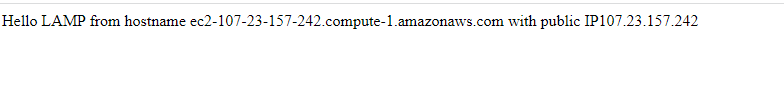

# STEP 5 - ENABLE PHP ON THE WEBSITE

`sudo vim /etc/apache2/mods-enabled/dir.conf`

`<IfModule mod_dir.c>
        #Change this:
        #DirectoryIndex index.html index.cgi index.pl index.php index.xhtml index.htm
        #To this:
        DirectoryIndex index.php index.html index.cgi index.pl index.xhtml index.htm
</IfModule>`

- After saving and closing the file, you will need to reload Apache so the changes take effect:
  `sudo systemctl reload apache2`

- Finally, we will create a PHP script to test that PHP is correctly installed and configured on your server.

Now that you have a custom location to host your website’s files and folders, we’ll create a PHP test script to confirm that Apache is able to handle and process requests for PHP files.

Create a new file named index.php inside your custom web root folder:

`vim /var/www/projectlamp/index.php`

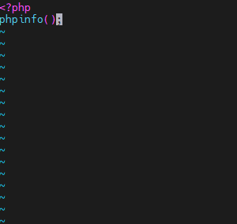

- I saved and closed the file, refreshed the page and saw:

  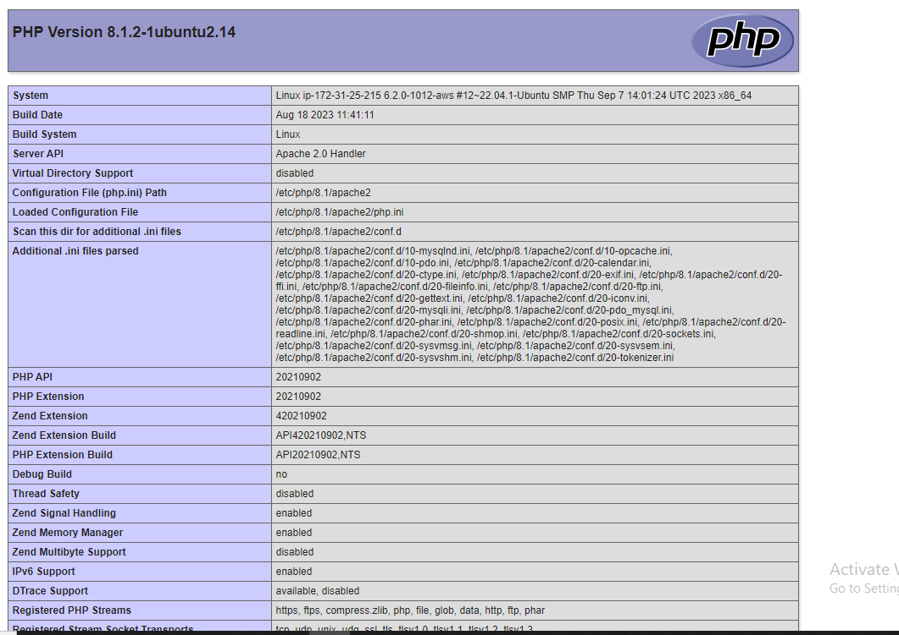
