# WEB STACK IMPLEMENTATION (LEMP STACK)

# STEP 1 - INSTALLATION OF NGINX WEB SERVER

- I started off by updating my server’s package index by running this command:
  `sudo apt update`
  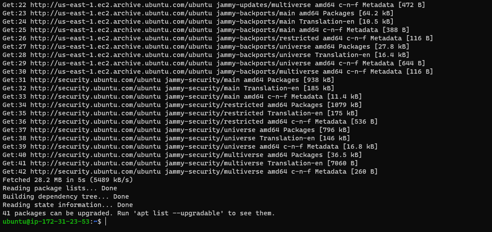

- Afterwards,I installed Nginx using apt package:
  `sudo apt install nginx`

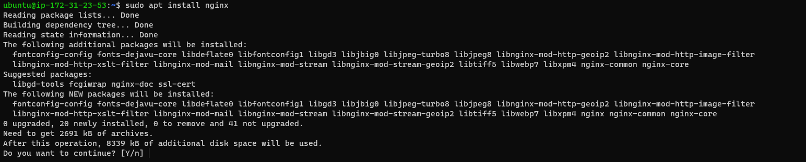

- I entered yes, and got my nginx installed as shown below

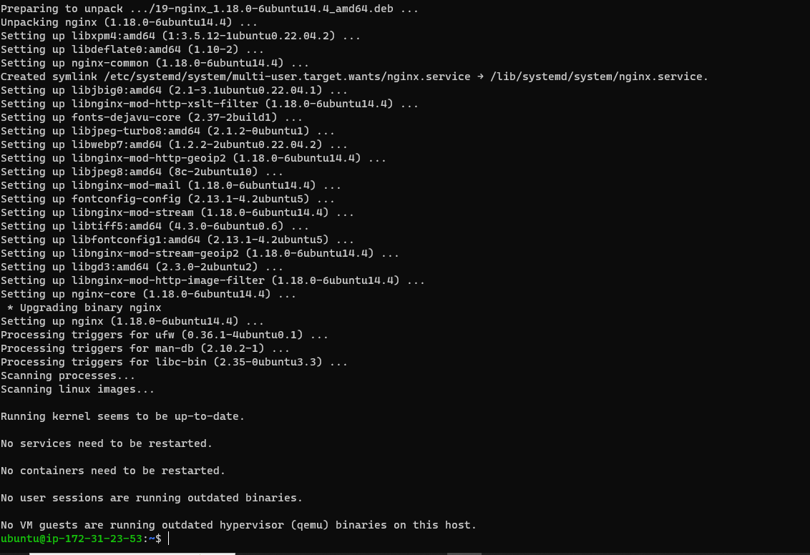

- To verify that nginx was successfully installed and is running as a service in Ubuntu, I ran:

`sudo systemctl status nginx`

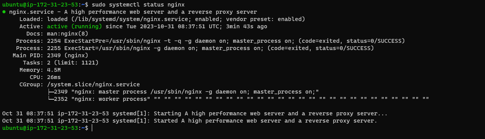

- I accessed it locally in my Ubuntu shell, by running:

`curl http://localhost:80`

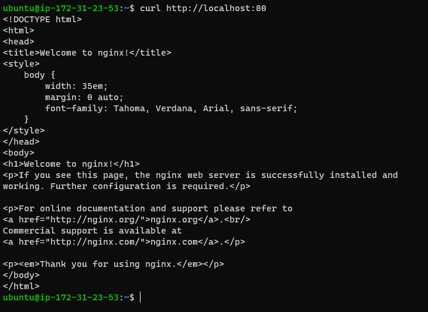

- To test how our Nginx server can respond to requests from the Internet. I opened chrome to access following url:
  `http://54.226.16.249/`

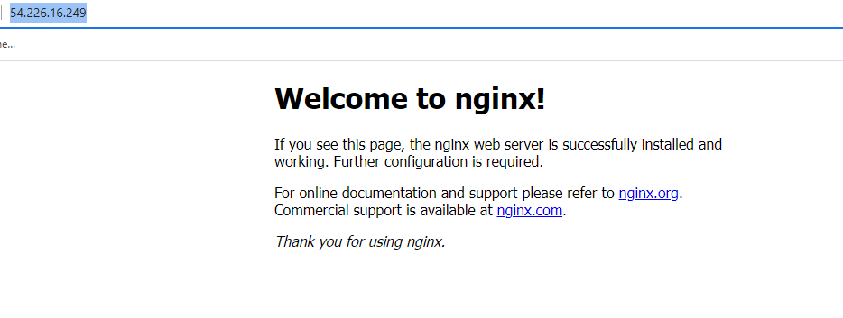

# STEP 2 - INSTALLING MYSQL

- Now that I have a web server up and running, MySQL Database Management System (DBMS) was installed to be able to store and manage data for the site in a relational database.

- To get MySQL installed, I ran this code:

`sudo apt install mysql-server`

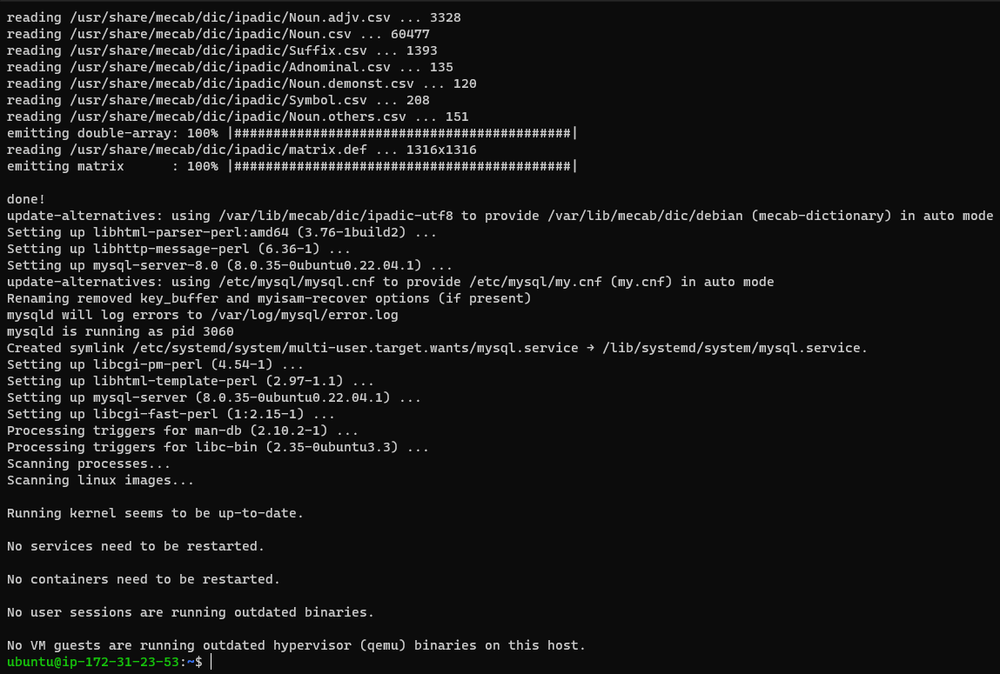

- After the installation, I logged in to MySQL by typin
  ` sudo mysql`

- I started the interactive script by running:

`sudo mysql_secure_installation`

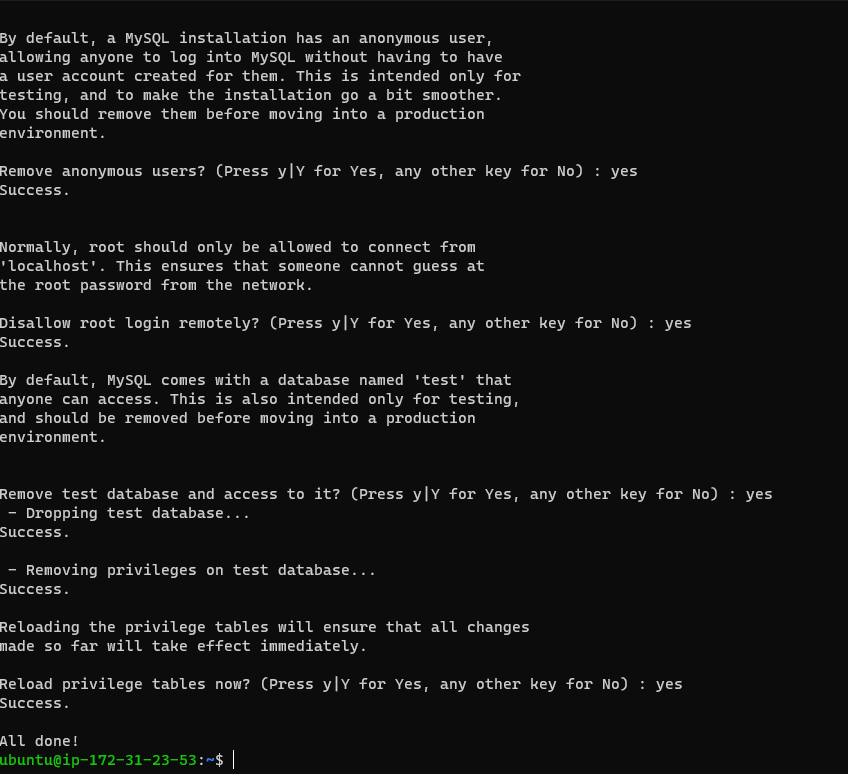

- I was able to log in to the MySQL console by typing:

`sudo mysql -p`

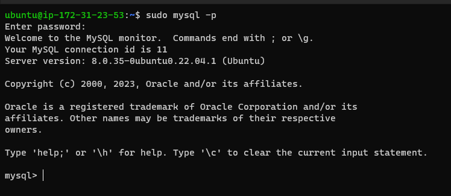

# STEP 3 - INSTALLING PHP

- While Apache embeds the PHP interpreter in each request, Nginx requires an external program to handle PHP processing and act as a bridge between the PHP interpreter itself and the web server. This allows for a better overall performance in most PHP-based websites, but it requires additional configuration. You’ll need to install php-fpm, which stands for “PHP fastCGI process manager”, and tell Nginx to pass PHP requests to this software for processing. Additionally, you’ll need php-mysql, a PHP module that allows PHP to communicate with MySQL-based databases. Core PHP packages will automatically be installed as dependencies.

- These two packages were installed y running:
  `udo apt install php-fpm php-mysql`

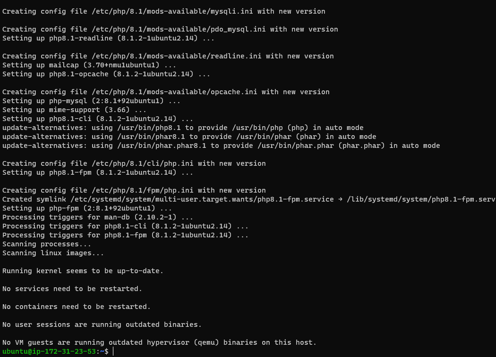

# STEP 4 - CONFIGURING NGINX TO USE PHP PROCESSOR

- On Ubuntu 20.04, Nginx has one server block enabled by default and is configured to serve documents out of a directory at /var/www/html. While this works well for a single site, it can become difficult to manage if you are hosting multiple sites. Instead of modifying /var/www/html, we’ll create a directory structure within /var/www for the your_domain website, leaving /var/www/html in place as the default directory to be served if a client request does not match any other sites.

- Root web directory was created for your_domain as follows:
  `sudo mkdir /var/www/projectLEMP`

- I assigned ownership of the directory with the $USER environment variable, which will reference my current system user:
`sudo chown -R $USER:$USER /var/www/projectLEMP`

- Then, I opened a new configuration file in Nginx’s sites-available directory using nano:

`sudo nano /etc/nginx/sites-available/projectLEMP`

- This created a new blank file and following bare-bones configuration pasted:

      - Activate your configuration by linking to the config file from Nginx’s sites-enabled directory:

       `sudo ln -s /etc/nginx/sites-available/projectLEMP /etc/nginx/sites-enabled/`

       - I tested the configuration by running:

       `sudo nginx -t`

      
       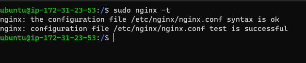

       - To disable default Nginx host that is currently configured to listen on port 80, for this run:

       `sudo unlink /etc/nginx/sites-enabled/default`

       - To apply the changes, I reloaded Nginx with:

       `sudo systemctl reload nginx`

       - Your new website is now active, but the web root /var/www/projectLEMP is still empty. Create an index.html file in that location so that we can test that your new server block works as expected:

       `sudo echo 'Hello LEMP from hostname' $(curl -s http://169.254.169.254/latest/meta-data/public-hostname) 'with public IP'`

  `$(curl -s http://169.254.169.254/latest/meta-data/public-ipv4) > /var/www/projectLEMP/index.html`

      - Then I opened the below url in my chrome browser :
      `http://54.226.16.249/`

      
      

