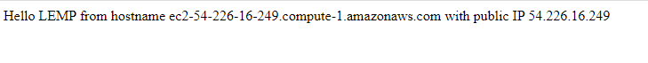
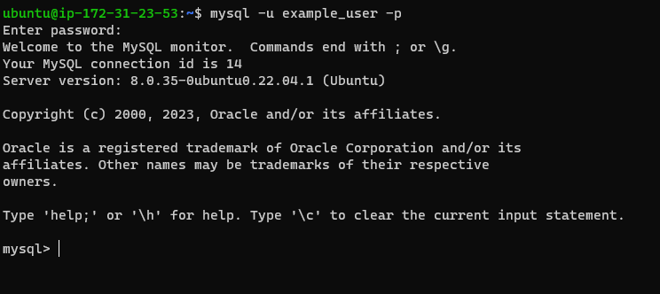
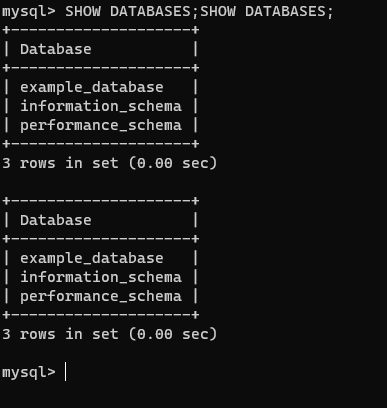
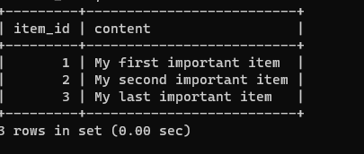
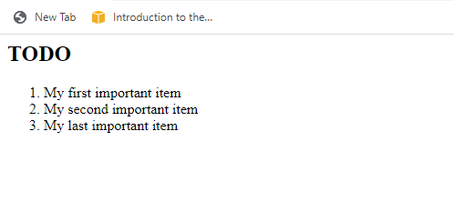

# WEB STACK IMPLEMENTATION (LEMP STACK)

# STEP 1 - INSTALLATION OF NGINX WEB SERVER

- I started off by updating my server’s package index by running this command:
  `sudo apt update`
  

- Afterwards,I installed Nginx using apt package:
  `sudo apt install nginx`

- I entered yes, and got my nginx installed as shown below

- To verify that nginx was successfully installed and is running as a service in Ubuntu, I ran:

`sudo systemctl status nginx`

- I accessed it locally in my Ubuntu shell, by running:

`curl http://localhost:80`

- To test how our Nginx server can respond to requests from the Internet. I opened chrome to access following url:
  `http://54.226.16.249/`

# STEP 2 - INSTALLING MYSQL

- Now that I have a web server up and running, MySQL Database Management System (DBMS) was installed to be able to store and manage data for the site in a relational database.

- To get MySQL installed, I ran this code:

`sudo apt install mysql-server`

- After the installation, I logged in to MySQL by typin
  ` sudo mysql`

- I started the interactive script by running:

`sudo mysql_secure_installation`

- I was able to log in to the MySQL console by typing:

`sudo mysql -p`

# STEP 3 - INSTALLING PHP

- While Apache embeds the PHP interpreter in each request, Nginx requires an external program to handle PHP processing and act as a bridge between the PHP interpreter itself and the web server. This allows for a better overall performance in most PHP-based websites, but it requires additional configuration. You’ll need to install php-fpm, which stands for “PHP fastCGI process manager”, and tell Nginx to pass PHP requests to this software for processing. Additionally, you’ll need php-mysql, a PHP module that allows PHP to communicate with MySQL-based databases. Core PHP packages will automatically be installed as dependencies.

- These two packages were installed y running:
  `udo apt install php-fpm php-mysql`

# STEP 4 - CONFIGURING NGINX TO USE PHP PROCESSOR

- On Ubuntu 20.04, Nginx has one server block enabled by default and is configured to serve documents out of a directory at /var/www/html. While this works well for a single site, it can become difficult to manage if you are hosting multiple sites. Instead of modifying /var/www/html, we’ll create a directory structure within /var/www for the your_domain website, leaving /var/www/html in place as the default directory to be served if a client request does not match any other sites.

- Root web directory was created for your_domain as follows:
  `sudo mkdir /var/www/projectLEMP`

- I assigned ownership of the directory with the $USER environment variable, which will reference my current system user:
`sudo chown -R $USER:$USER /var/www/projectLEMP`

- Then, I opened a new configuration file in Nginx’s sites-available directory using nano:

`sudo nano /etc/nginx/sites-available/projectLEMP`

- This created a new blank file and following bare-bones configuration pasted:

- Activate your configuration by linking to the config file from Nginx’s sites-enabled directory:

`sudo ln -s /etc/nginx/sites-available/projectLEMP /etc/nginx/sites-enabled/`

- I tested the configuration by running:

`sudo nginx -t`

- To disable default Nginx host that is currently configured to listen on port 80, for this run:

`sudo unlink /etc/nginx/sites-enabled/default`

- To apply the changes, I reloaded Nginx with:

`sudo systemctl reload nginx`

- Your new website is now active, but the web root /var/www/projectLEMP is still empty. Create an index.html file in that location so that we can test that your new server block works as expected:

`sudo echo 'Hello LEMP from hostname' $(curl -s http://169.254.169.254/latest/meta-data/public-hostname) 'with public IP'`

`$(curl -s http://169.254.169.254/latest/meta-data/public-ipv4) > /var/www/projectLEMP/index.html`

- Then I opened the below url in my chrome browser :

`http://54.226.16.249/`

# STEP 5 - TESTING PHP WITH NGINX

- To test php to validate that Nginx can correctly hand .php files off to your PHP processor.
- run this code:
  `sudo vi /var/www/projectLEMP/info.php`

- You can now access this page in your web browser by visiting the domain name or public IP address you’ve set up in your Nginx configuration file, followed by /info.php:

`http://54.226.16.249/info.php`

- To remove the file, I ran this command:

`sudo rm /var/www/projectLEMP/info.php`

# STEP 6 -RETRIEVING DATA FROM MYSQL DATABASE WITH PHP (CONTINUED)

- I first connected to mysql console using:

`sudo mysql`

- To create a new database, I ran the following command from my MySQL console:

`CREATE DATABASE `example_database`;`

- The following command creates a new user named example_user, using mysql_native_password as default authentication method. We’re defining this user’s password as password, but you should replace this value with a secure password of your own choosing.

`CREATE USER 'example_user'@'%' IDENTIFIED WITH mysql_native_password BY 'password';`

- Now we need to give this user permission over the example_database database:

`GRANT ALL ON example_database.* TO 'example_user'@'%';`

- Now exit the MySQL shell with:

`exit`

- You can test if the new user has the proper permissions by logging in to the MySQL console again, this time using the custom user credentials:

- To ensure I have access to database, I ran the following command:

`SHOW DATABASES;`

- Next, we’ll create a test table named todo_list. From the MySQL console, run the following statement:

`CREATE TABLE example_database.todo_list ( item_id INT AUTO_INCREMENT,content VARCHAR(255PRIMARY KEY(item_id));`

- Insert a few rows of content in the test table. You might want to repeat the next command a few times, using different VALUES:

`INSERT INTO example_database.todo_list (content) VALUES ("My first important item");`

- To confirm that the data was successfully saved to your table, run:

`SELECT * FROM example_database.todo_list;mysql>  SELECT * FROM example_database.todo_list;`

- I exited mysql console using:

`exit`

- Now you can create a PHP script that will connect to MySQL and query for your content. Create a new PHP file in your custom web root directory using your preferred editor. We’ll use vi for that:

`vi /var/www/projectLEMP/todo_list.php`

`<?php
$user = "example_user";
$password = "password";
$database = "example_database";
$table = "todo_list";

try {
$db = new PDO("mysql:host=localhost;dbname=$database", $user, $password);
  echo "<h2>TODO</h2><ol>";
  foreach($db->query("SELECT content FROM $table") as $row) {
echo "<li>" . $row['content'] . "</li>";
}
echo "</ol>";
} catch (PDOException $e) {
print "Error!: " . $e->getMessage() . " ";
die();
}`

- I saved and can now access this page in my web browser by visiting the domain name or public IP address configured for my website, followed by /todo_list.php:

`http://54.226.16.249/todo_list.php`

# THE END!!!
