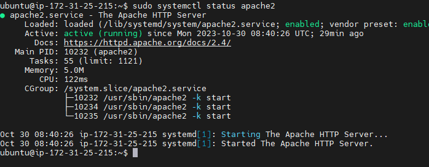

# WEB-STACK IMPLEMENTATION USING LAMP

## STEP1- INSTALLATION OF APACHE AND FIREWALL UPDATE

- Installation of Apache using Ubuntu’s package manager ‘apt’

`sudo apt update`

- run apache2 package installation

`sudo apt install apache2`

##### To be sure apache is running as a service in my OS, I ran the following command

`sudo systemctl status apache2`

