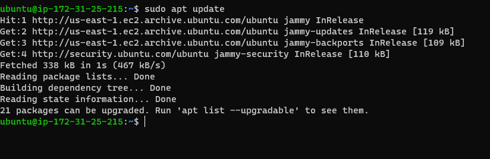
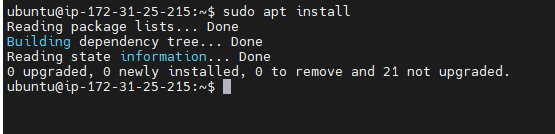

# WEB-STACK IMPLEMENTATION USING LAMP

## STEP1- INSTALLATION OF APACHE AND FIREWALL UPDATE

- Installation of Apache using Ubuntu’s package manager ‘apt’

`sudo apt update`

- run apache2 package installation
  `sudo apt install apache2`
  
