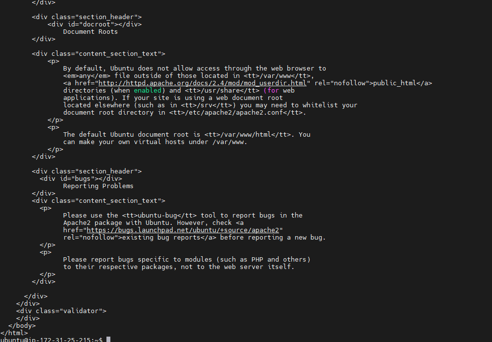

# WEB-STACK IMPLEMENTATION USING LAMP

## STEP1- INSTALLATION OF APACHE AND FIREWALL UPDATE

- Installation of Apache using Ubuntu’s package manager ‘apt’

`sudo apt update`

- run apache2 package installation

`sudo apt install apache2`

##### To be sure apache is running as a service in my OS, I ran the following command

`sudo systemctl status apache2`

- My server is running and I can access it locally and from the Internet (Source 0.0.0.0/0 means ‘from any IP address’).
- To access it, run this command

`curl http://localhost:80`

- To test how my Apache HTTP server can respond to requests from the Internet. I opened chrome and pasted this url

`http://107.23.157.242:80`
